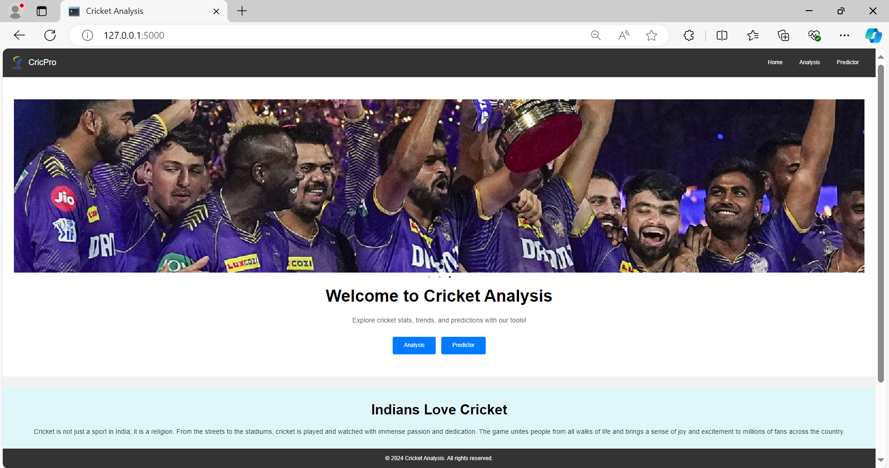
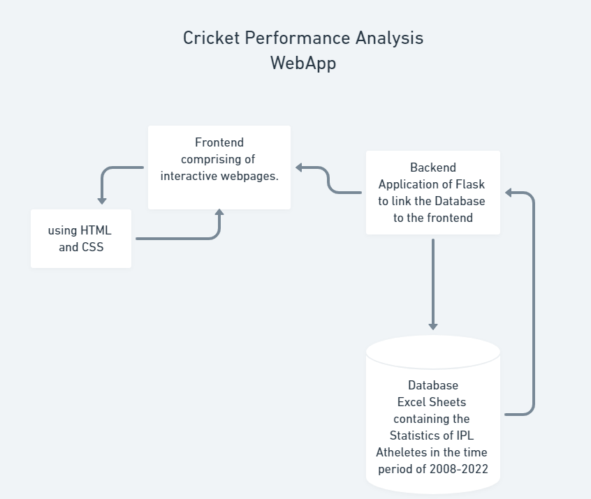

# Player Performance Analyser
For Cricket Enthusiasts

## Introduction
The purpose of this internship was to develop a web application for analyzing and predicting the performance of cricket players using historical data. This project aims to assist cricket analysts, coaches, and enthusiasts in making data-driven decisions by providing visualizations and predictive insights. I had a great time in this internship having the opportunity to learn about different Machine Learning Models and Python Libraries.

## Project Overview
This project involved creating a web application using Flask, a Python web framework. The application allows users to analyze historical data of cricket players, visualize their performance, and predict future performance. The data is sourced from CSV files containing detailed statistics of players' batting and bowling performances, which was obtained from Kaggle.

## Project Preview
Project URL: [Subbi8/Player-Performance-Analyser](https://github.com/Subbi8/Player-Performance-Analyser)

## Flow Diagram
The flow diagram depicts how our project looks. The frontend comprises HTML and CSS for dynamic and interactive web pages, backed by Python Flask for a robust backend. The data is obtained through the excel sheets stored, which is the player data to facilitate our Player Performance Analyser.

## Tech Stack Used
### Frontend:
- HTML: For structuring the web pages.
- CSS: For styling the web pages.
- JavaScript: For adding interactivity to the web pages.
- Bootstrap: For responsive design and pre-designed components.

### Backend:
- Flask: A lightweight Python web framework used to handle web requests and serve web pages.
- Pandas: For data manipulation and analysis.
- Matplotlib: For creating static, animated, and interactive visualizations.
- Seaborn: For statistical data visualization.
- NumPy: For numerical operations.
- Scikit-learn: For machine learning and predictive modeling.
- io and base64: For handling image data in the web application.

## Working of the Project
1. **Data Loading and Preprocessing**
    - The project starts by loading two CSV files containing batting and bowling statistics. These files are read using the pandas library. Missing values and non-numeric entries are handled appropriately to ensure smooth analysis and visualization.

2. **Data Analysis and Visualization**
    - The application provides several types of visualizations to analyze player performance:
        - **Histogram**: A bar chart representing the distribution of a player's performance metrics.
        - **Line Plot**: A plot showing the trends in a player's performance over time.

3. **Prediction Model**
    - Using the LinearRegression model from scikit-learn, the application predicts future performance based on historical data. This involves training the model on past data and using it to forecast future scores.

4. **Web Application**
    - The Flask application serves several routes:
        - **Home Page (/)**: Displays the main page of the application.
        - **Check Player (/check_player)**: Checks if a player's name exists in the dataset.
        - **Analyze (/analyze)**: Provides visualizations of a player's performance.
        - **Predictor (/predictor)**: Predicts a player's future performance.
        - **Autocomplete (/autocomplete)**: Suggests player names based on user input.

## Method to run the Code
1. Download the zip file from the Github link [Subbi8/Player-Performance-Analyser](https://github.com/Subbi8/Player-Performance-Analyser).
2. Unzip the Folder.
3. Go to the directory wherever you have stored your unzipped folder.
4. Run the command `python app.py` on your command line.

